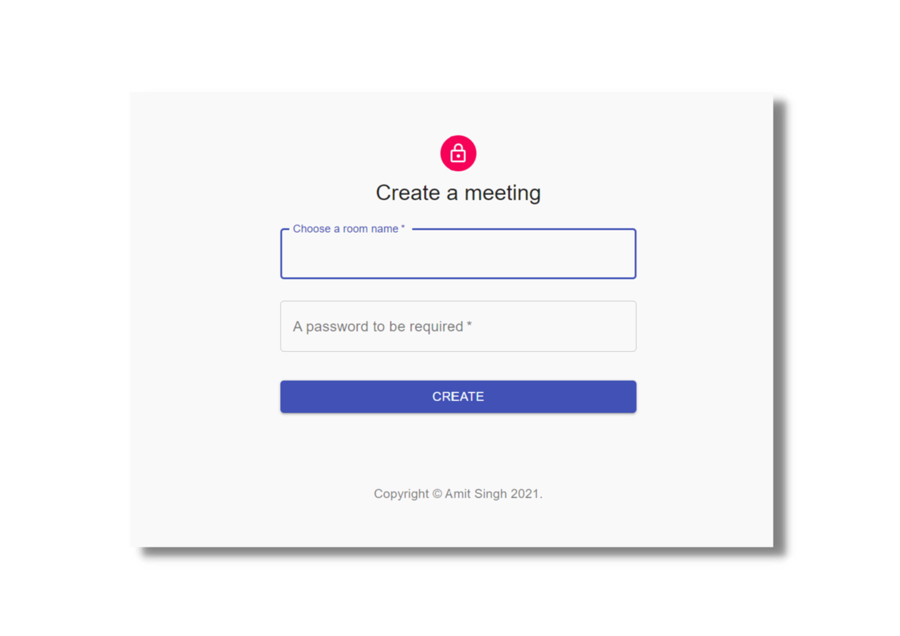

# VMeet


[](https://opensource.org/licenses/MIT)

A video conferencing platform powered by **Jitsi** api infrastructure.

VMeet provides a good video quality and latency.





## Features


- Virtual Background
- Chat
- Text chat
- Raise Hand
- Live Recording 
- Live Streaming
- No download required, entirely browser based
- Direct peer to peer connection ensures lowest latency
- and many more

<br>
<br>
## Quick start

- You will need to have Node.js installed, this project has been tested with Node version 12.X and 14.X
- Clone this repo

```
git clone https://github.com/amitycodingclub/VMeet.git
cd VMeet-main
```

#### Install dependencies

```
npm install
```

### Build react app

```
npm build
```

#### Start the server

```
npm start
```

- Open `localhost:3000` in browser and use

## Contributing

Feel Free to contribute! <br>
especially the **front-end** ✌
